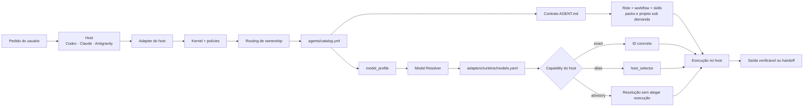

# AI Agent Config — Agent Runtime portátil

O `ai-agent-config` é o **control plane declarativo** de um Agent Runtime
portátil para Codex, Claude Code e Antigravity. Ele define quais agentes existem,
como uma demanda escolhe seu owner, qual contexto cada agente recebe, qual perfil
de modelo precisa, como esse perfil é traduzido para cada host e como o trabalho
é transferido entre agentes sem ampliar a autoridade concedida pelo usuário.

O host continua sendo o **execution plane**: é Codex, Claude Code ou Antigravity
que executa o modelo, oferece ferramentas, controla permissões e, quando houver
suporte, materializa subagentes. Este repositório não é um daemon, scheduler,
fila de tarefas ou SDK de inferência independente.

## O que o Agent Runtime faz

- mantém um catálogo canônico de agentes e seus limites de ownership;
- roteia a demanda para um único owner por padrão;
- compõe contexto mínimo a partir de kernel, contrato, role, workflow, skills e
  context packs, carregados sob demanda;
- resolve `model_profile` agnóstico para modelo e selector específicos do host;
- adapta a execução às capabilities verificadas de cada runtime;
- preserva escopo, evidências, restrições e autoridade em handoffs explícitos;
- distribui o mesmo núcleo para os três hosts sem duplicar agentes ou
  conhecimento técnico;
- falha de forma explícita quando agente, perfil, mapping, selector ou fallback
  obrigatório estiver ausente;
- valida estrutura, geração dos adapters, instalação, regressões e drift.

## O que ele não faz

- não substitui o runtime do fornecedor nem escolhe ferramentas disponíveis;
- não mantém scheduler, banco de estado, fila, UI ou observabilidade central;
- não detecta sozinho quota, entitlement ou indisponibilidade de modelo;
- não faz retry automático após falha real do provedor;
- não transforma seleção por alias em garantia de versão concreta;
- não concede acesso a arquivos, rede, produção ou ações destrutivas;
- não trata execução sequencial como paralelismo nem resolução como prova de
  materialização.

## Arquitetura



Arquiteturalmente, o runtime separa **intenção portátil** de **mecanismo do
host**. Agentes, políticas e perfis não conhecem fornecedor. Somente o adapter
conhece nomes concretos, selectors e limitações do runtime.

### Camadas e fontes canônicas

| Camada | Responsabilidade | Fonte |
| --- | --- | --- |
| Bootstrap | Instalar o núcleo e indicar a raiz local | `adapters/templates/`, `scripts/install-agents.rb` |
| Kernel | Precedência, segurança, saída e carregamento econômico | `core/`, `context/agent-core.md` |
| Routing | Escolher o owner e evitar pipelines desnecessários | `context-index.md`, `agents/_shared/routing-context-policy.md` |
| Catálogo | Relacionar agente, contrato, perfil, role, workflows e skills | `agents/catalog.yml` |
| Contrato | Definir missão, entradas, saídas, limites e handoffs | `agents/<id>/AGENT.md` |
| Contexto | Especializar comportamento sem copiar conhecimento | `roles/`, `workflows/`, `skills/`, `context-packs/`, `projects/` |
| Model routing | Traduzir intenção agnóstica para o runtime | `models/`, `adapters/<runtime>/models.yaml`, `scripts/resolve-model.rb` |
| Handoff | Transferir ownership e autoridade de forma verificável | `agents/_shared/handoff-protocol.md`, `templates/agent-handoff.md` |
| Distribuição | Gerar e sincronizar os adapters dos hosts | `config/context-manifest.yml`, `scripts/sync-platforms.rb` |
| Qualidade | Detectar configuração inválida, regressão e drift | `scripts/validate-structure.sh`, `scripts/test-integration.rb`, `scripts/check-context-drift.rb` |

## Como uma demanda é executada

1. **Bootstrap do host.** O adapter instalado informa a raiz deste repositório e
   carrega o kernel compartilhado. Regras do usuário, do host e do projeto
   consumidor continuam com precedência.
2. **Routing.** O objetivo principal é classificado e encaminhado ao agente com
   ownership direto. Outro agente entra apenas quando houver troca real de
   ownership, especialidade necessária ou revisão independente.
3. **Composição de contexto.** O runtime carrega o contrato do agente, uma role,
   o workflow da etapa e somente skills, packs, projeto e evidências pertinentes.
   O histórico inteiro e a biblioteca completa não são carregados por padrão.
4. **Resolução do modelo.** O agente fornece apenas `model_profile`. O resolver
   consulta o mapping do runtime e escolhe `primary` ou o primeiro fallback ainda
   disponível.
5. **Materialização.** O host recebe ID exato, alias ou somente uma recomendação,
   conforme suas capabilities. Ausência de suporte nativo não é mascarada como
   sucesso.
6. **Execução e saída.** O agente segue seu contrato e entrega um artefato
   verificável. Se outro owner precisar continuar, recebe um handoff completo;
   contexto ausente mantém o handoff `blocked`.
7. **Persistência seletiva.** Código e configuração portátil ficam neste
   repositório. Decisões reais, estado vivo e aprendizados observados pertencem
   ao cofre autorizado, nunca a transcrições ou logs brutos.

## Agentes disponíveis

| Agente | Ownership principal | `model_profile` |
| --- | --- | --- |
| `orchestrator` | Coordenar owners, dependências e handoffs | `reasoning-high` |
| `product-manager` | Problema, valor, escopo e critérios de aceite | `analysis-medium` |
| `architect` | Decisões estruturais, ADRs e review arquitetural | `reasoning-high` |
| `software-engineer` | Implementação, bugfix, refactor e diagnóstico | `coding-high` |
| `tester` | Validação independente e evidência de aceite | `coding-balanced` |
| `code-reviewer` | Review de código orientado a risco | `review-high` |
| `security-engineer` | Trust boundaries, ameaças e controles | `reasoning-high` |
| `performance-engineer` | Baseline, gargalos e avaliação de performance | `reasoning-high` |

`orchestrator` não é um scheduler e não substitui os outros papéis. Ele coordena
quando a entrega realmente cruza owners; uma tarefa simples continua com um
único agente.

## Model routing agnóstico

O agente conhece somente seu perfil de capacidade. Os perfis canônicos ficam em
`models/profiles.yaml`; modelos concretos, ordem de fallback e capabilities
ficam em `adapters/<runtime>/models.yaml`.

```text
software-engineer
  -> coding-high
  -> adapter do runtime
  -> primary / fallbacks
  -> model + host_selector + selection_mode + materializable
```

Exemplo:

```bash
ruby scripts/resolve-model.rb \
  --runtime claude \
  --agent software-engineer \
  --unavailable claude-opus-5-5 \
  --format json
```

```json
{
  "runtime": "claude",
  "agent": "software-engineer",
  "profile": "coding-high",
  "model": "claude-sonnet-5-5",
  "host_selector": "sonnet",
  "selection_mode": "alias",
  "materializable": true,
  "fallback": true
}
```

### Capabilities por runtime

| Runtime | Seleção | Materialização testada | Semântica |
| --- | --- | --- | --- |
| Codex | `exact` | Sim | `host_selector` é o ID concreto aceito pelo host |
| Claude Code | `alias` | Sim | o host recebe `opus`, `sonnet` ou `haiku`; transcript/metadata confirmam o modelo efetivo quando disponíveis |
| Antigravity | `advisory` | Não | o resolver expressa a preferência, mas não afirma execução em subagente |

Essas capabilities representam os hosts efetivamente testados, não uma promessa
permanente dos fornecedores. Mudanças de versão, conta ou entitlement exigem
nova validação.

### Fallback

O fallback é ordenado e fail-closed:

1. tenta o `primary`;
2. ignora somente modelos informados como indisponíveis;
3. seleciona o primeiro fallback restante;
4. falha explicitamente quando a lista se esgota.

Erro de prompt, ferramenta, autenticação, permissão ou qualidade não autoriza
downgrade silencioso. Atualmente o runtime precisa informar a indisponibilidade,
inclusive por `--unavailable`; detecção automática e retry de materialização
ainda não fazem parte desta implementação.

## Segurança, autoridade e handoff

- pedido atual, policies do host e regras do projeto consumidor têm precedência;
- um adapter informa onde carregar contexto, mas não concede acesso;
- o agente selecionado não assume autoridade de outro papel;
- handoff preserva autoridade já concedida e nunca cria permissão nova;
- ausência de escopo, aceite, artefato ou fonte verificável mantém o handoff
  `blocked`;
- revisão independente exige outra sessão/agente ou revisão humana;
- segredo, PII, log bruto e output de build não entram em adapters, packs ou no
  cofre.

## Instalação rápida

Consulte também [o guia de integração](docs/agent-integration.md). O instalador
mostra um plano sem escrita e preserva instruções existentes:

```bash
ruby scripts/install-agents.rb --user --agents codex,claude,antigravity
```

Revise os destinos e aplique explicitamente:

```bash
ruby scripts/install-agents.rb \
  --user \
  --agents codex,claude,antigravity \
  --apply
```

Para um projeto consumidor, use `--project` com seu caminho absoluto. Abra uma
sessão nova depois de atualizar as regras; uma sessão já iniciada pode manter o
contexto anterior. Gemini CLI está fora do escopo; a integração Google mantida é
o Antigravity.

## Validação

```bash
ruby scripts/sync-platforms.rb
ruby scripts/check-context-drift.rb
./scripts/validate-structure.sh
ruby scripts/test-integration.rb
```

O primeiro comando é dry-run; use `--apply` somente após revisar o plano. Depois
de alterar skills, execute também `./scripts/package-skills.sh`.

O fechamento local de 2026-10-04 validou 62 testes, 216 assertions, as 24
combinações agente × runtime, adapters sem drift e instalação idempotente nos
três hosts. Isso comprova contratos e integração exercitada, mas não garante
disponibilidade futura do provedor nem substitui smoke tests em sessões novas.

Sessões reais e critérios de aceite estão em
[tests/session-cases.md](tests/session-cases.md); resultados e limitações por host
estão em [tests/session-results.md](tests/session-results.md). A fundação e seus
trade-offs estão em [docs/agent-platform.md](docs/agent-platform.md).

## Compilador de contexto

O contexto fixo é composto pelo manifesto; roles, workflows, packs e projetos
continuam sob demanda. Para atualizar os adaptadores:

```bash
ruby scripts/sync-platforms.rb
ruby scripts/sync-platforms.rb --apply
ruby scripts/check-context-drift.rb
./scripts/validate-structure.sh
ruby scripts/test-integration.rb
```

O sincronizador preserva conteúdo não gerado em backup, escreve de forma
atômica e se torna idempotente depois da primeira geração. O instalador usa o
mesmo renderer e mantém blocos externos às marcações gerenciadas.

As skills são agnósticas ao agente. A fonte canônica é:

`~/ai-agent-config/skills/`

Edite o `SKILL.md` e seus recursos sempre nessa pasta. Os symlinks locais e os
ZIPs para upload derivam dessa mesma fonte.

## Symlinks locais

[fato] Nesta instalação, os agentes locais acessam as sete skills por symlinks.
Cada diretório configurado contém links com os mesmos sete nomes:

| Agente | Diretório local | Destino de cada link |
| --- | --- | --- |
| Claude Code | `~/.claude/skills/` | `~/ai-agent-config/skills/<nome>/` |
| Codex | `~/.agents/skills/` ou o legado local `~/.codex/skills/` | `~/ai-agent-config/skills/<nome>/` |
| Antigravity | `~/.gemini/config/skills/` | `~/ai-agent-config/skills/<nome>/` |

Nomes: `arquiteto-solucoes`, `engenheiro-software-senior`,
`mentor-aprendizado`, `mentor-tecnico`, `architecture-review`, `code-review` e
`troubleshooting`.

### Instalar pelos symlinks

O fluxo recomendado usa o instalador, que primeiro valida a fonte e os
conflitos. Confira o plano sem escrita:

```bash
ruby scripts/install-agents.rb --user --agents codex,claude,antigravity
```

Se os destinos estiverem corretos, aplique o mesmo plano:

```bash
ruby scripts/install-agents.rb --user --agents codex,claude,antigravity --apply
```

O instalador cria links para todas as skills da fonte, incluindo
`mentor-aprendizado`. Para instalar somente essa skill manualmente, escolha
apenas o diretório do agente desejado:

```bash
# Codex — use este destino quando não houver configuração legada.
mkdir -p ~/.agents/skills
ln -s ~/ai-agent-config/skills/mentor-aprendizado ~/.agents/skills/mentor-aprendizado

# Claude Code.
mkdir -p ~/.claude/skills
ln -s ~/ai-agent-config/skills/mentor-aprendizado ~/.claude/skills/mentor-aprendizado

# Antigravity.
mkdir -p ~/.gemini/config/skills
ln -s ~/ai-agent-config/skills/mentor-aprendizado ~/.gemini/config/skills/mentor-aprendizado
```

Se o Codex local já usa `~/.codex/skills/`, crie o link nesse diretório em vez
de também usar `~/.agents/skills/`; manter os dois pode exibir aliases
duplicados. Os comandos manuais recusam um destino existente: revise-o em vez
de usar `ln -sf` e sobrescrever silenciosamente.

Os links apontam para os mesmos arquivos; não é necessário copiar as alterações
nem gerar ZIPs para esses consumidores locais. Isso não garante que uma sessão
já aberta recarregue instruções que leu anteriormente: após editar, valide em
uma nova sessão e reinicie o agente caso a alteração não apareça.

Para conferir os links existentes:

```bash
ls -l \
  ~/.claude/skills/ \
  ~/.agents/skills/ \
  ~/.codex/skills/ \
  ~/.gemini/config/skills/
```

[fato] A documentação atual do Codex confirma o suporte a pastas de skills via
symlink e lista `~/.agents/skills/` como diretório de usuário. Os caminhos
`~/.codex/skills/` acima descrevem a configuração local deste repositório;
ao configurar outra instalação, confira os locais de descoberta da versão usada.
Veja a [documentação oficial de skills do Codex](https://learn.chatgpt.com/docs/build-skills).

## Claude UI: distribuição por upload

A UI do Claude (web ou aplicativo, no fluxo de skills pessoais) não lê os
symlinks locais de `~/.claude/skills/` ou `~/.codex/skills/`. Ela usa a skill
enviada por upload. Alterar a fonte no Mac não atualiza automaticamente a
versão enviada: é necessário gerar um novo ZIP e atualizar a skill na UI.

### Gerar os ZIPs

Pré-requisitos: Bash, Ruby com a biblioteca YAML, `zip` e as ferramentas usadas
pelo script (`find`, `sort` com suporte a `-z` e `sed`) disponíveis no terminal.
O script precisa ter permissão de execução.

Na raiz do repositório, execute:

```bash
cd ~/ai-agent-config
./scripts/package-skills.sh
```

Se houver erro de permissão de execução, ajuste uma vez e repita:

```bash
chmod +x ./scripts/package-skills.sh
./scripts/package-skills.sh
```

[fato] O script encontra as subpastas diretamente em `skills/` que contêm
`SKILL.md`, rejeita qualquer symlink dentro do pacote, valida o frontmatter YAML
e a presença de `name` e `description`, e recria o ZIP correspondente em
`dist/`. ZIPs sem skill correspondente são movidos para uma subpasta recuperável
em `dist/.stale/`, em vez de aparecerem como artefatos atuais. O empacotador
rejeita destinos de saída por symlink e arquivos potencialmente sensíveis como
`.env`, `.npmrc`, `.pypirc`, chaves privadas e certificados privados. Também
exclui `.DS_Store`, metadados de Git/IDE e temporários. Essa
validação não substitui a validação de upload do Claude.

Com as skills atuais, é gerado um ZIP por subpasta válida de `skills/`, por
exemplo:

```text
~/ai-agent-config/dist/arquiteto-solucoes.zip
~/ai-agent-config/dist/engenheiro-software-senior.zip
~/ai-agent-config/dist/mentor-aprendizado.zip
~/ai-agent-config/dist/mentor-tecnico.zip
```

Cada ZIP contém a pasta da própria skill na raiz, com `SKILL.md` e seus recursos
internos. Envie cada ZIP individualmente, sem compactar `dist/` inteira. Essa é a
[estrutura de pacote documentada pelo Claude](https://support.claude.com/en/articles/12512198-how-to-create-custom-skills).

### Fazer upload e atualizar na UI

[fato] O fluxo documentado para adicionar uma skill é:

1. Abra **Personalizar → Skills** (**Customize → Skills**).
2. Clique em **+ → Criar skill** (**Create skill**).
3. Selecione **Fazer upload de uma skill** (**Upload a skill**).
4. Escolha o ZIP correspondente em `~/ai-agent-config/dist/`.
5. Confira se a skill aparece na lista e habilite-a.

Se a seção não estiver disponível, confira se a execução de código e criação de
arquivos está habilitada; em contas organizacionais, confira também a permissão
para criar skills. Consulte o [guia oficial de uso de skills no Claude](https://support.claude.com/en/articles/12512180-use-skills-in-claude).

Para atualizar uma skill já instalada, gere novamente os ZIPs e abra a skill
existente na UI. Se a interface oferecer substituição do pacote, envie o novo
ZIP por essa opção. Caso não ofereça, desative a versão antiga e faça um novo
upload pelo fluxo acima; habilite e teste a nova versão antes de remover a antiga.
Evite manter duas versões da mesma skill ativas. Não presuma que um upload com
o mesmo nome substitui automaticamente a versão anterior.

Os rótulos e as opções de atualização podem variar na interface. O script apenas
gera os pacotes locais; ele não faz upload nem sincroniza a conta do Claude.

### Gitignore

[fato] O `.gitignore` já contém estas regras, que devem ser mantidas:

```gitignore
dist/
*.zip
```

Versione a fonte em `skills/`, o script e a documentação. Os ZIPs são artefatos
regeneráveis para distribuição. As regras de ignore não deixam de rastrear um
arquivo que já tenha sido versionado anteriormente.

## Workflow após editar uma skill

1. Edite `~/ai-agent-config/skills/<nome-da-skill>/SKILL.md` e os recursos necessários.
2. Valide a alteração em uma nova sessão do Claude Code e/ou Codex; os symlinks
   continuam apontando para a fonte atualizada.
3. Na raiz de `~/ai-agent-config`, execute `./scripts/package-skills.sh` e confira
   a conclusão sem erros e os arquivos gerados em `dist/`.
4. Atualize na UI do Claude cada skill alterada usando seu novo ZIP.
5. Habilite a versão atual e teste uma solicitação compatível com a skill em uma
   nova conversa para conferir o comportamento.
6. Revise o diff da fonte e da documentação. Mantenha `dist/` e `*.zip` fora do Git;
   faça commit e push somente quando decidir explicitamente versionar/publicar.

## Segundo cérebro

Este repositório guarda a parte **portátil e versionada** do segundo cérebro:
comportamento dos agentes, perfil técnico, conhecimento curado, templates e
trilhas de aprendizado.

O conhecimento **vivo e factual** continua separado no Obsidian:

Vault:

`~/obsidian/claude-second-brain/`

O cofre continua sendo a fonte de verdade para decisões reais, estado de
projetos, preferências confirmadas, gotchas e aprendizados observados. Não copie
automaticamente notas entre os dois locais: defina a autoridade antes de
registrar para evitar divergência.

## Árvore do repositório

```text
ai-agent-config/
├── AGENTS.md
├── CLAUDE.md
├── GEMINI.md
├── context-index.md
├── config/context-manifest.yml
├── context/
├── core/
├── agents/
│   ├── _shared/
│   ├── catalog.yml
│   └── <agent>/AGENT.md
├── models/
│   ├── profiles.yaml
│   ├── selection-policy.md
│   └── fallback-policy.md
├── roles/
├── workflows/
├── context-packs/
├── adapters/
├── docs/
├── profiles/
├── skills/
│   ├── arquiteto-solucoes/
│   ├── engenheiro-software-senior/
│   ├── mentor-aprendizado/
│   ├── mentor-tecnico/
│   ├── architecture-review/
│   ├── code-review/
│   └── troubleshooting/
├── knowledge/
│   ├── architecture/  java/  spring/  kafka/
│   ├── kubernetes/    cloud/ ddd/     databases/
│   └── observability/ performance/ ai-engineering/
├── learning/
│   ├── kafka/
│   └── ddd/
├── templates/
├── projects/
├── prompts/
├── scripts/
└── tests/
```

## Criar uma nova trilha

```bash
./scripts/create-learning-topic.sh spring-security
```

O comando aceita nomes em kebab-case e recusa sobrescrever uma pasta existente.
Ele cria `context.md`, `roadmap.md`, `progress.md`, `notes.md` e `exercises.md`.

## Validar a estrutura

```bash
./scripts/validate-structure.sh
```

Execute a validação antes de empacotar skills. Ela interpreta YAML, valida
nome/pasta, campos, limites, corpo, referências obrigatórias do pacote, todos
os tópicos de aprendizado, arquivos do manifesto e imports de contexto.
O package-skills.sh existente permanece preservado; execute a validação primeiro.

## Regra

Não editar cópias específicas em `.claude` ou `.codex`.

Editar sempre a fonte canônica em:

`~/ai-agent-config/skills/`
